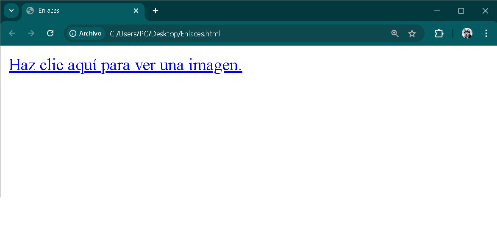
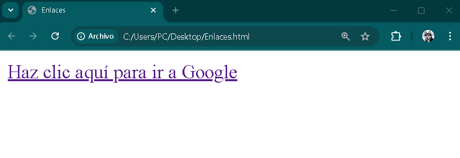
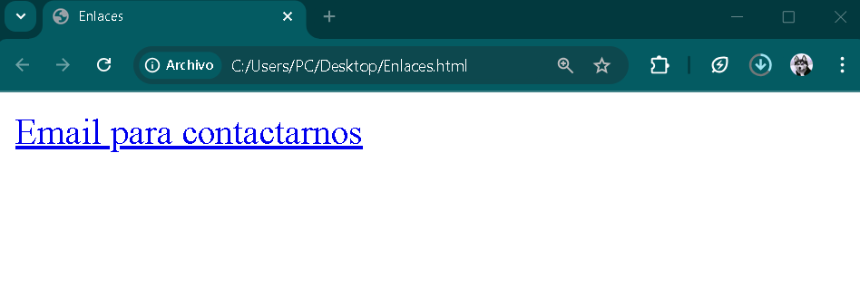
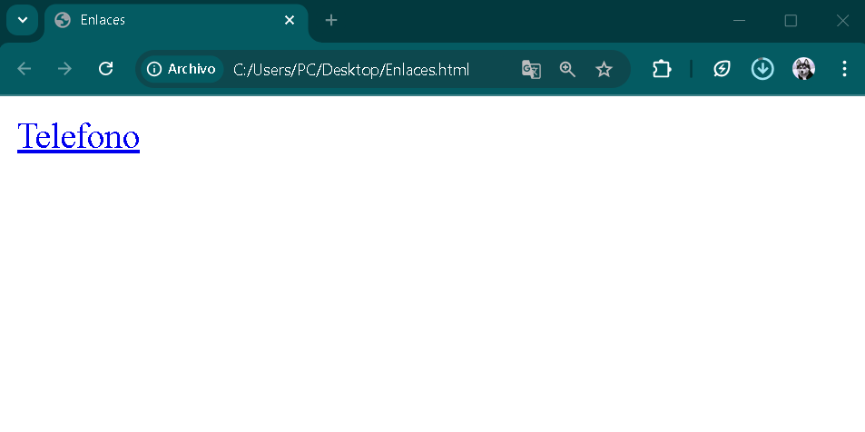

# `<a>` Elemento Ancla.

El elemento **HTML** `<a>` Ancla se utiliza para crear enlaces a otros documentos Web, archivos, secciones dentro del mismo documento, direcciones de correo electrónico u otros **URL**.

Sintaxis:
```HTML
<a href=" ">Clic aquí</a>
```

## El atributo `href` en los enlaces.

`href` es la abreviatura de *Hypertext Reference* (Refencia de Hipertexto). Este atributo define la **URL*** a la que apunta el enlace, es decir, la dirección a la que se dirigirá el navegador cuando se haga clic en él.

*Ejemplos de uso:*

En cuanto al uso de la etiqueta `<a>`, existen diversas aplicaciones prácticas. A continuación, se presentan algunos ejemplos:

## Uso de etiqueta `<a>` con archivos locales:

Con esta etiqueta, podemos crear enlaces o vínculos hacia diferentes archivos. Por ejemplo, desde nuestro documento podemos hacer que el usuario abra una imagen al hacer clic en el enlace.

<hr>


Esta es nuestra imagen, a la que hemos nombrado `imagen`. Se encuentra en el escritorio. La idea es que, mediante la codificación `HTML` en nuestra página, podamos permitir que el usuario acceda a la imagen al hacer clic en el enlace.

Crearemos un texto con un enlace que nos llevará a la imagen. El texto dirá *Haz clic aquí para ver una imagen*. A continuación, veremos algunos ejemplos visuales en código `HTML`: 

```HTML
1    <!DOCTYPE html>
2        <html>
3            <head>
4                <title>Enlaces</title>
5            </head>
6            <body>
7                <a href="imagen.png">Haz clic aquí para ver una imagen.</a>
8            </body>
9        </html>
```
Como podemos observar en la línea de código número `9`, utilizamos la etiqueta `<a>` y dentro de ella empleamos el **atributo** `href=""`. Es importante destacar que dentro de las comillas debemos colocar el nombre del archivo junto con su extensión, por ejemplo, esta imagen tiene la extensión `.png`.

Sintaxis usada: 
```HTML
 <a href="imagen.png">Clic aquí para ver una imagen.</a> 
 ```
Una vez ingresado el enlace, debemos escribir el texto. En este caso, el texto será:*"Haz clic aquí para ver una imagen"*. A continuación, veremos los resultados en el documento.



> Haremos clic para ver qué sucede.


## Nueva pestaña: `target="_blank"`

Como podemos ver, al hacer clic en el texto de nuestra página principal, nos dirige directamente al archivo. Ahora, vamos a agregar un atributo más a nuestra etiqueta `<a>`, de modo que, al hacer clic en el texto, la imagen se abra en una nueva pestaña. A continuación, veremos el siguiente ejemplo:

```HTML
1    <!DOCTYPE html>
2        <html>
3            <head>
4                <title>Enlaces</title>
5            </head>
6            <body>
7                <a href="imagen.png" target="_blank">Haz clic aquí para ver una imagen.</a>
8            </body>
9        </html>
```

El atributo agregado es el `target`, y dentro de este atributo utilizamos `_blank`.

Sintaxis usada:
```HTML
   <a href="imagen.png" target="_blank">Clic aquí para ver una imagen</a>
```
## Hipervinculo enrutado.

Supongamos que nuestra imagen se encuentra dentro de una carpeta. ¿Cómo haríamos para acceder a ella? Pues, la sintaxis de nuestra etiqueta `<a>` cambiaría de la siguiente manera:
```HTML
<a href="carpeta/imagen.png">Clic aquí para ver una imagen</a>
```
Como habrán notado, solo fue necesario indicar el nombre de la carpeta seguido de una barra diagonal `/` y, a continuación, el nombre de la imagen.

## Enlaces externos.

El siguiente ejemplo mostrará cómo vincular nuestra etiqueta `<a>` a una **URL** externa. Como demostración, configuraremos el enlace para redirigirnos a *Google* desde nuestra página. A continuación, veamos el código:

```HTML
<!DOCTYPE html>
   <html>
      <head>
         <title>Enlaces</title>
      </head>
      <body>
         <a href="https://www.google.com">Clic aquí para ir a Google</a>
      </body>
   </html>
```
Como podemos observar, en el atributo `href` hemos colocado la **URL** de *Google* junto con el protocolo `https`. Recuerden que, si se trata de un enlace externo, es imprescindible incluir el protocolo de transmisión; de lo contrario, el enlace no funcionará.

Sintaxis usada:

> <a href="https://www.google.com">Clic aquí parra ir a Google</a>

Veamos también qué cambió en nuestra página:



Bien, ahora veamos qué sucede al hacer clic en el texto con el hipervínculo:


Como podemos observar, nuestra página nos redirige a *Google*.

Este ejemplo utilizó *google.com*, pero el mismo procedimiento se puede aplicar a cualquier otra **URL** que conozcamos.

## Email y Telefonos.

Con la etiqueta `<a>`, también podemos hacer que, al hacer clic, se abra una ventana para enviar un correro electrónico a una dirección específica.
A continuación, se muestra un ejemplo de cómo hacerlo:

```HTML
<!DOCTYPE html>
   <html>
      <head>
         <title>Enlaces</title>
      </head>
      <body>
         <a href="mailto:leguiza.nicolas2018@gmail.com">leguiza.nicolas2018@gmail.com</a>
      </body>
   </html>
```
Sintaxis usada:

```HTML
<a href="mailto:leguiza.nicolas2018@gmail.com">leguiza.nicolas2018@gmail.com</a>
```
Un aspecto a destacar es que no es necesario mostrar la dirección de correo electrónico en el texto del enlace. En su lugar, podemos utilizar un mensaje como *Email para contactarnos*, y el enlace seguirá funcionando correctamente.

Veamos un ejemplo:

```HTML
<a href="mailto:leguiza.nicolas2018@gmail.com">Email para contactarnos</a>
```
Veamos cómo se visualiza en nuestro documento y comprobemos su funcionamiento.



Ahora veamos cómo funciona en teléfonos celulares.

En el atributo `href`, esta vez debemos utilizar la palabra clave `tel:`, seguida del número de teléfono al que queremos llamar o enviar un mensaje. Esta función es más efectiva en dispositivos móviles que en computadoras.

En una **PC**, al hacer clic, se ejecutará una aplicación de Microsoft, mientras que en un celular, el enlace se abrira en la aplicación de llamadas o en WhatsApp, según la configuración del dispositivo.

Veamos cómo quedó la codificación:

```HTML
<!DOCTYPE html>
   <html>
      <head>
         <title>Enlaces</title>
      </head>
      <body>
         <a href="tel:+5491130301010">Telefono</a>
      </body>
   </html>
```
Veamos cómo nos quedó en nuestro documento:



